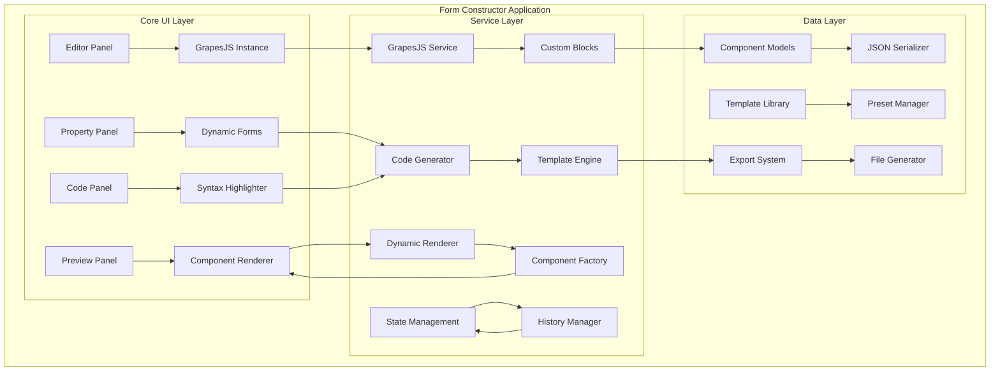
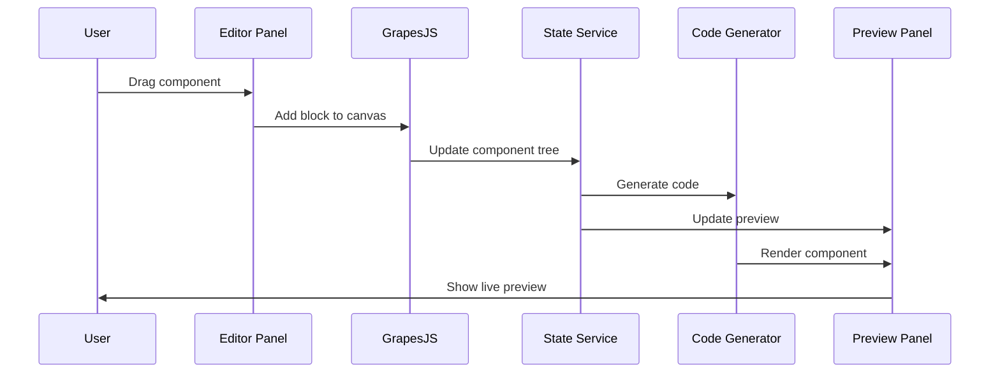

# Form Constructor Architecture Plan

## 🎯 Project Overview

A comprehensive drag-and-drop form constructor built with **Angular 19** and **GrapesJS** that enables developers to quickly prototype and generate production-ready Angular form components through visual design.

### Target Audience
- Developers who need rapid prototyping of Angular forms
- Teams requiring consistent form component generation
- Projects needing visual form design with clean code output

### Key Design Principles
- **Angular 19 Standalone Components** - Modern, NgModule-free architecture
- **Custom CSS Design System** - Full control with CSS Grid, Flexbox, CSS Variables
- **Production-Ready Code Generation** - Clean, maintainable Angular components
- **Developer-Focused UX** - Optimized for technical users

## 🏗️ System Architecture



## 📁 Project Structure

```
/src/app/
├── core/
│   ├── models/
│   │   ├── component.model.ts           # Base component interfaces
│   │   ├── form-element.model.ts        # Form element types
│   │   ├── layout.model.ts              # Layout and container models
│   │   └── export.model.ts              # Export configuration types
│   ├── services/
│   │   ├── grapesjs.service.ts          # GrapesJS integration
│   │   ├── code-generator.service.ts    # Angular code generation
│   │   ├── dynamic-renderer.service.ts  # Runtime component rendering
│   │   ├── state-management.service.ts  # Application state
│   │   ├── template-library.service.ts  # Pre-built templates
│   │   └── export.service.ts            # File export handling
│   ├── guards/
│   │   └── unsaved-changes.guard.ts     # Prevent data loss
│   └── pipes/
│       └── safe-html.pipe.ts            # HTML sanitization
├── shared/
│   ├── components/
│   │   ├── code-editor/                 # Syntax-highlighted code display
│   │   ├── property-editor/             # Dynamic property forms
│   │   ├── component-tree/              # Hierarchical view
│   │   └── responsive-preview/          # Breakpoint switcher
│   ├── directives/
│   │   ├── droppable.directive.ts       # Drop zone handling
│   │   └── resizable.directive.ts       # Element resizing
│   └── utils/
│       ├── css-generator.util.ts        # CSS utility functions
│       ├── validation-rules.util.ts     # Form validation helpers
│       └── template-parser.util.ts      # Template processing
├── form-constructor/
│   ├── components/
│   │   ├── editor-panel/
│   │   │   ├── editor-panel.component.ts
│   │   │   ├── editor-panel.component.html
│   │   │   └── editor-panel.component.css
│   │   ├── property-panel/
│   │   │   ├── property-panel.component.ts
│   │   │   ├── property-panel.component.html
│   │   │   └── property-panel.component.css
│   │   ├── preview-panel/
│   │   │   ├── preview-panel.component.ts
│   │   │   ├── preview-panel.component.html
│   │   │   └── preview-panel.component.css
│   │   ├── code-panel/
│   │   │   ├── code-panel.component.ts
│   │   │   ├── code-panel.component.html
│   │   │   └── code-panel.component.css
│   │   ├── toolbar/
│   │   │   ├── toolbar.component.ts
│   │   │   ├── toolbar.component.html
│   │   │   └── toolbar.component.css
│   │   └── main-layout/
│   │       ├── main-layout.component.ts
│   │       ├── main-layout.component.html
│   │       └── main-layout.component.css
│   ├── blocks/
│   │   ├── input-blocks/                # Input field variations
│   │   ├── container-blocks/            # Layout containers
│   │   ├── form-blocks/                 # Form-specific elements
│   │   └── custom-blocks/               # User-defined blocks
│   └── templates/
│       ├── contact-form/
│       ├── registration-form/
│       ├── survey-form/
│       └── custom-templates/
├── dynamic-components/
│   ├── base/
│   │   ├── base-form-element.component.ts
│   │   └── base-container.component.ts
│   ├── inputs/
│   │   ├── dynamic-input.component.ts
│   │   ├── dynamic-textarea.component.ts
│   │   ├── dynamic-select.component.ts
│   │   └── dynamic-checkbox.component.ts
│   └── containers/
│       ├── dynamic-container.component.ts
│       ├── dynamic-grid.component.ts
│       └── dynamic-flex.component.ts
└── assets/
    ├── styles/
    │   ├── design-system.css            # CSS variables and tokens
    │   ├── component-styles.css         # Reusable component styles
    │   └── editor-theme.css             # GrapesJS customization
    └── templates/
        ├── component-templates/         # Angular component templates
        └── form-templates/              # Complete form layouts
```

## 🎨 Design System Architecture

### CSS Variables Structure
```css
:root {
  /* Colors */
  --primary-color: #2563eb;
  --secondary-color: #64748b;
  --accent-color: #f59e0b;
  --surface-color: #ffffff;
  --background-color: #f8fafc;
  
  /* Spacing Scale */
  --space-xs: 0.25rem;
  --space-sm: 0.5rem;
  --space-md: 1rem;
  --space-lg: 1.5rem;
  --space-xl: 2rem;
  
  /* Typography */
  --font-family-primary: 'Inter', system-ui, sans-serif;
  --font-family-mono: 'JetBrains Mono', monospace;
  
  /* Layout */
  --header-height: 3.5rem;
  --sidebar-width: 16rem;
  --panel-min-width: 20rem;
  
  /* Shadows */
  --shadow-sm: 0 1px 2px 0 rgb(0 0 0 / 0.05);
  --shadow-md: 0 4px 6px -1px rgb(0 0 0 / 0.1);
  --shadow-lg: 0 10px 15px -3px rgb(0 0 0 / 0.1);
}
```

### Layout Grid System
```css
.layout-grid {
  display: grid;
  grid-template-areas: 
    "header header header header"
    "toolbar editor preview properties";
  grid-template-columns: auto 1fr 1fr auto;
  grid-template-rows: var(--header-height) 1fr;
  height: 100vh;
  overflow: hidden;
}
```

## ⚙️ Technical Implementation Strategy

### 1. GrapesJS Integration Pattern

```typescript
// grapesjs.service.ts
@Injectable({ providedIn: 'root' })
export class GrapesJSService {
  public editor: grapesjs.Editor | null = null;
  public componentDefinitions = new Map<string, ComponentDefinition>();
  
  initializeEditor(container: HTMLElement): grapesjs.Editor {
    this.editor = grapesjs.init({
      container,
      plugins: [
        'gjs-blocks-basic',
        'gjs-plugin-forms',
        'grapesjs-custom-angular-blocks' // Custom plugin
      ],
      pluginsOpts: {
        'grapesjs-custom-angular-blocks': {
          blocks: this.getAngularBlocks()
        }
      }
    });
    
    this.registerCustomComponents();
    return this.editor;
  }
  
  public getAngularBlocks(): BlockDefinition[] {
    return [
      {
        id: 'angular-input',
        label: 'Text Input',
        category: 'Angular Forms',
        content: {
          type: 'angular-input',
          tagName: 'div',
          attributes: { class: 'form-input-wrapper' }
        }
      }
      // Additional blocks...
    ];
  }
}
```

### 2. Code Generation Engine

```typescript
// code-generator.service.ts
@Injectable({ providedIn: 'root' })
export class CodeGeneratorService {
  generateComponent(structure: ComponentStructure): GeneratedComponent {
    return {
      typescript: this.generateTypeScript(structure),
      html: this.generateTemplate(structure),
      css: this.generateStyles(structure),
      imports: this.generateImports(structure)
    };
  }
  
  public generateTypeScript(structure: ComponentStructure): string {
    return `import { Component } from '@angular/core';
import { ReactiveFormsModule, FormBuilder, FormGroup } from '@angular/forms';

@Component({
  selector: '${structure.selector}',
  standalone: true,
  imports: [ReactiveFormsModule],
  templateUrl: './${structure.name}.component.html',
  styleUrl: './${structure.name}.component.css'
})
export class ${structure.className} {
  ${this.generateFormGroup(structure)}
  
  constructor(public fb: FormBuilder) {
    ${this.generateFormInitialization(structure)}
  }
  
  ${this.generateMethods(structure)}
}`;
  }
}
```

### 3. Dynamic Component Rendering

```typescript
// dynamic-renderer.service.ts
@Injectable({ providedIn: 'root' })
export class DynamicRendererService {
  public componentCache = new Map<string, Type<any>>();
  
  renderComponent(
    definition: ComponentDefinition, 
    container: ViewContainerRef
  ): ComponentRef<any> {
    const componentType = this.getOrCreateComponent(definition);
    return container.createComponent(componentType);
  }
  
  public getOrCreateComponent(definition: ComponentDefinition): Type<any> {
    if (this.componentCache.has(definition.id)) {
      return this.componentCache.get(definition.id)!;
    }
    
    const dynamicComponent = this.createDynamicComponent(definition);
    this.componentCache.set(definition.id, dynamicComponent);
    return dynamicComponent;
  }
}
```

## 🔄 Data Flow Architecture



## 🧩 Component Block System

### Base Block Interface
```typescript
interface AngularBlock {
  id: string;
  label: string;
  category: string;
  icon?: string;
  content: BlockContent;
  properties: PropertyDefinition[];
  validation?: ValidationRule[];
  preview: PreviewConfig;
}

interface PropertyDefinition {
  name: string;
  type: 'text' | 'number' | 'select' | 'boolean' | 'color' | 'spacing';
  label: string;
  defaultValue?: any;
  options?: SelectOption[];
  validators?: ValidatorConfig[];
}
```

### Form Element Blocks
1. **Input Components**
   - Text Input (`angular-input`)
   - Email Input (`angular-email`)
   - Password Input (`angular-password`)
   - Number Input (`angular-number`)
   - Date Input (`angular-date`)

2. **Selection Components**
   - Dropdown (`angular-select`)
   - Radio Group (`angular-radio`)
   - Checkbox (`angular-checkbox`)
   - Multi-select (`angular-multiselect`)

3. **Text Components**
   - Textarea (`angular-textarea`)
   - Rich Text Editor (`angular-richtext`)

4. **Layout Components**
   - Container (`angular-container`)
   - Grid Layout (`angular-grid`)
   - Flex Layout (`angular-flex`)
   - Card (`angular-card`)

5. **Action Components**
   - Submit Button (`angular-submit`)
   - Reset Button (`angular-reset`)
   - Custom Button (`angular-button`)

## 📱 Responsive Design Strategy

### Breakpoint System
```typescript
const BREAKPOINTS = {
  mobile: '(max-width: 768px)',
  tablet: '(min-width: 769px) and (max-width: 1024px)',
  desktop: '(min-width: 1025px)'
};
```

### Preview Panel Implementation
- **Device Simulator**: iPhone, iPad, Desktop views
- **Custom Breakpoints**: User-defined screen sizes
- **Orientation Toggle**: Portrait/Landscape switching
- **Interactive Testing**: Click-through functionality

## 🚀 Export System Architecture

### Export Options
1. **Individual Files**: Separate .ts, .html, .css files
2. **Complete Component**: Zip archive with all files
3. **Code Snippets**: Copy-to-clipboard functionality
4. **Project Integration**: Direct Angular CLI integration

### File Generation Templates
```typescript
interface ExportTemplate {
  component: string;      // TypeScript class
  template: string;       // HTML template
  styles: string;         // CSS styles
  spec: string;          // Unit tests
  module?: string;       // NgModule (legacy support)
  dependencies: string[]; // Required imports
}
```

## 🔧 Development Phases

### Phase 1: Foundation (MVP)
- Basic Angular 19 setup with GrapesJS
- Core layout with editor and preview panels
- Basic form blocks (input, button, container)
- Simple code generation

### Phase 2: Core Features
- Property panel with dynamic forms
- Advanced form elements (select, radio, checkbox)
- Real-time preview with iframe isolation
- JSON serialization/deserialization

### Phase 3: Advanced Features
- Template library with pre-built forms
- Validation rules builder
- Responsive design preview
- Export system for downloadable files

### Phase 4: Polish & Optimization
- Undo/redo functionality
- Layer management system
- Performance optimizations
- Comprehensive testing

## 🎯 Success Metrics

1. **Developer Experience**
   - Time to create a functional form: < 5 minutes
   - Clean, readable generated code
   - Zero manual fixes required for basic forms

2. **Technical Quality**
   - Generated components pass Angular lint rules
   - Full TypeScript type safety
   - Accessible HTML structure
   - Responsive design by default

3. **Performance**
   - Editor loads in < 2 seconds
   - Real-time preview updates in < 100ms
   - Supports forms with 50+ components

This architectural plan provides a solid foundation for building a comprehensive, developer-focused form constructor that leverages Angular 19's modern capabilities while maintaining clean, production-ready code generation.