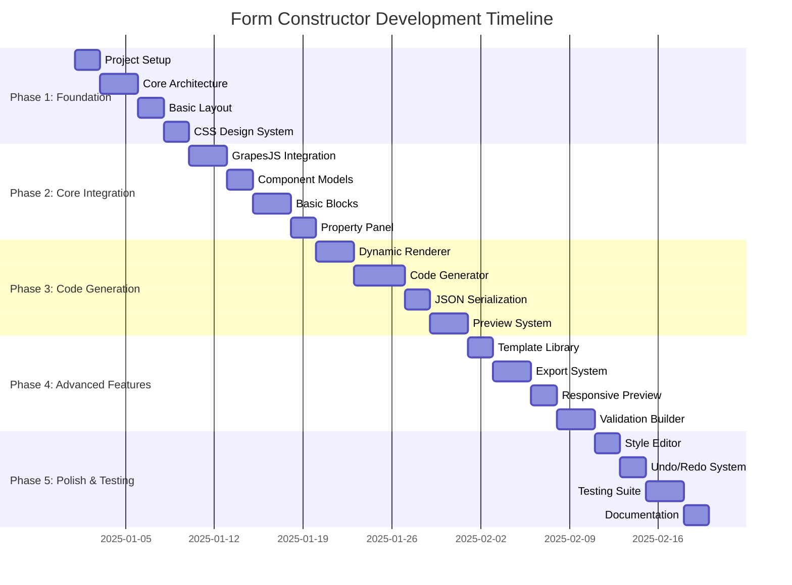

# Implementation Roadmap: Angular 19 Form Constructor

## 📊 Project Timeline Overview



## 🎯 Phase 1: Foundation Setup (Days 1-9)

### Milestone 1.1: Project Dependencies (Days 1-2)
**Objective**: Install and configure all necessary dependencies for GrapesJS integration

**Tasks**:
- [ ] Install GrapesJS core and plugins
- [ ] Add TypeScript definitions
- [ ] Configure build system for external libraries
- [ ] Setup development environment

**Dependencies to Install**:
```json
{
  "grapesjs": "^0.21.0",
  "@types/grapesjs": "^0.17.0",
  "grapesjs-blocks-basic": "^1.0.0",
  "grapesjs-plugin-forms": "^2.0.0",
  "codemirror": "^6.0.0",
  "@codemirror/lang-javascript": "^6.0.0",
  "@codemirror/lang-html": "^6.0.0",
  "@codemirror/lang-css": "^6.0.0",
  "@codemirror/theme-one-dark": "^6.0.0",
  "highlight.js": "^11.9.0",
  "jszip": "^3.10.0",
  "file-saver": "^2.0.5",
  "@types/file-saver": "^2.0.5"
}
```

**Acceptance Criteria**:
- [ ] All dependencies installed without conflicts
- [ ] TypeScript compilation successful
- [ ] No build errors or warnings
- [ ] GrapesJS imports correctly in Angular

**Risk Assessment**: Low - Standard dependency installation
**Estimated Effort**: 4 hours

### Milestone 1.2: Core Architecture (Days 3-5)
**Objective**: Create the foundational folder structure and base services

**Folder Structure Creation**:
```
/src/app/
├── core/
│   ├── models/
│   ├── services/
│   ├── guards/
│   └── pipes/
├── shared/
│   ├── components/
│   ├── directives/
│   └── utils/
├── form-constructor/
│   ├── components/
│   ├── blocks/
│   └── templates/
└── dynamic-components/
    ├── base/
    ├── inputs/
    └── containers/
```

**Base Interfaces and Models**:
- [ ] `BaseComponent` interface
- [ ] `FormComponent` interface  
- [ ] `ContainerComponent` interface
- [ ] `ComponentType` enum
- [ ] `ValidationRule` interface
- [ ] `GeneratedComponent` interface

**Acceptance Criteria**:
- [ ] All folders created with README files
- [ ] Base interfaces defined and exported
- [ ] TypeScript strict mode compliance
- [ ] Import/export structure working

**Risk Assessment**: Low - Basic file structure setup
**Estimated Effort**: 8 hours

### Milestone 1.3: Main Layout (Days 6-7)
**Objective**: Implement the core application layout with grid system

**Components to Create**:
- [ ] `MainLayoutComponent` - Overall application shell
- [ ] `HeaderComponent` - Top navigation and toolbar
- [ ] `ToolbarComponent` - Component library sidebar
- [ ] Layout service for panel management

**Layout Features**:
- [ ] CSS Grid-based responsive layout
- [ ] Collapsible panels
- [ ] Resizable panel dividers
- [ ] Mobile-responsive breakpoints

**Acceptance Criteria**:
- [ ] 4-panel layout renders correctly
- [ ] Panels can be resized and collapsed
- [ ] Responsive behavior on mobile/tablet
- [ ] Clean, professional visual design

**Risk Assessment**: Medium - Complex CSS Grid implementation
**Estimated Effort**: 12 hours

### Milestone 1.4: CSS Design System (Days 8-9)
**Objective**: Establish comprehensive CSS design system with variables and utilities

**Design System Components**:
- [ ] CSS custom properties (variables)
- [ ] Typography scale and font loading
- [ ] Color palette and semantic tokens
- [ ] Spacing and sizing scales
- [ ] Component style utilities
- [ ] Animation and transition library

**Acceptance Criteria**:
- [ ] Consistent visual hierarchy
- [ ] Accessible color contrasts (WCAG AA)
- [ ] Smooth animations and transitions
- [ ] Dark mode support (future-ready)
- [ ] Cross-browser compatibility

**Risk Assessment**: Low - Standard CSS implementation
**Estimated Effort**: 10 hours

## 🔧 Phase 2: Core Integration (Days 10-19)

### Milestone 2.1: GrapesJS Integration (Days 10-12)
**Objective**: Successfully integrate GrapesJS with Angular and create custom editor service

**Integration Tasks**:
- [ ] Create `GrapesJSService` with Angular lifecycle integration
- [ ] Configure GrapesJS editor with custom options
- [ ] Setup plugin architecture for Angular-specific blocks
- [ ] Implement event handling and component selection

**Technical Requirements**:
- [ ] Editor initialization in `ngAfterViewInit`
- [ ] Proper cleanup in `ngOnDestroy`
- [ ] Signal-based state management
- [ ] Custom CSS integration with Angular styles

**Acceptance Criteria**:
- [ ] GrapesJS editor loads without errors
- [ ] Basic drag-and-drop functionality works
- [ ] Component selection events properly handled
- [ ] Editor state synchronized with Angular

**Risk Assessment**: High - Complex third-party integration
**Mitigation**: Extensive testing and fallback strategies
**Estimated Effort**: 18 hours

### Milestone 2.2: Component Models (Days 13-14)
**Objective**: Define comprehensive data models for all form components

**Model Definitions**:
- [ ] Form input components (text, email, password, number)
- [ ] Selection components (select, radio, checkbox)
- [ ] Layout components (container, grid, flex)
- [ ] Action components (button, submit, reset)

**Features**:
- [ ] TypeScript strict typing
- [ ] JSON serializable structures
- [ ] Validation rule definitions
- [ ] Styling property interfaces

**Acceptance Criteria**:
- [ ] All component types properly typed
- [ ] Models support full serialization/deserialization
- [ ] Validation rules integrated
- [ ] Clear documentation for each interface

**Risk Assessment**: Low - Standard TypeScript interface definition
**Estimated Effort**: 10 hours

### Milestone 2.3: Basic GrapesJS Blocks (Days 15-17)
**Objective**: Create custom GrapesJS blocks for Angular form components

**Block Development**:
- [ ] Text Input block with configurable properties
- [ ] Select/Dropdown block with options management
- [ ] Checkbox and Radio button blocks
- [ ] Container block for layout grouping
- [ ] Button block with action configuration

**Block Features**:
- [ ] Custom icons and labels
- [ ] Proper drag-and-drop behavior
- [ ] Default property values
- [ ] Category organization
- [ ] Preview thumbnails

**Acceptance Criteria**:
- [ ] All blocks appear in component library
- [ ] Drag-and-drop creates proper HTML structure
- [ ] Blocks are properly categorized
- [ ] Visual feedback during dragging

**Risk Assessment**: Medium - GrapesJS plugin development complexity
**Estimated Effort**: 16 hours

### Milestone 2.4: Property Panel (Days 18-19)
**Objective**: Build dynamic property editing panel for selected components

**Property Panel Features**:
- [ ] Dynamic form generation based on component type
- [ ] Real-time property updates
- [ ] Validation and error handling
- [ ] Grouped property sections (General, Styling, Validation)

**Property Types**:
- [ ] Text inputs for labels and placeholders
- [ ] Checkbox for boolean properties
- [ ] Select dropdowns for predefined options
- [ ] Color pickers for styling
- [ ] Number inputs with validation

**Acceptance Criteria**:
- [ ] Property panel updates when component selected
- [ ] Changes immediately reflect in editor
- [ ] Form validation prevents invalid inputs
- [ ] Professional, intuitive user interface

**Risk Assessment**: Medium - Complex dynamic form handling
**Estimated Effort**: 12 hours

## ⚡ Phase 3: Code Generation (Days 20-31)

### Milestone 3.1: Dynamic Renderer (Days 20-22)
**Objective**: Build service to dynamically render Angular components for preview

**Renderer Features**:
- [ ] Component factory for dynamic creation
- [ ] Property binding system
- [ ] Event handling setup
- [ ] Lifecycle management
- [ ] Performance optimization with caching

**Technical Implementation**:
- [ ] Use Angular's `ViewContainerRef` for dynamic insertion
- [ ] Create base dynamic component classes
- [ ] Implement property injection system
- [ ] Setup event propagation

**Acceptance Criteria**:
- [ ] Components render correctly in preview
- [ ] Properties update in real-time
- [ ] Events work as expected
- [ ] Memory leaks prevented with proper cleanup

**Risk Assessment**: High - Complex Angular dynamic component system
**Mitigation**: Extensive testing and memory profiling
**Estimated Effort**: 20 hours

### Milestone 3.2: Code Generator (Days 23-26)
**Objective**: Create comprehensive Angular component code generation system

**Code Generation Features**:
- [ ] TypeScript class generation
- [ ] HTML template generation
- [ ] CSS styles generation
- [ ] Reactive forms integration
- [ ] Import statement management
- [ ] Unit test generation (optional)

**Template System**:
- [ ] Modular template engine
- [ ] Variable substitution
- [ ] Conditional code blocks
- [ ] Code formatting and beautification

**Acceptance Criteria**:
- [ ] Generated code compiles without errors
- [ ] Code follows Angular style guide
- [ ] Reactive forms properly configured
- [ ] Generated components are fully functional

**Risk Assessment**: High - Complex code generation logic
**Mitigation**: Extensive test cases and validation
**Estimated Effort**: 24 hours

### Milestone 3.3: JSON Serialization (Days 27-28)
**Objective**: Implement complete save/load functionality for form structures

**Serialization Features**:
- [ ] Component tree serialization
- [ ] Property preservation
- [ ] Styling information retention
- [ ] Validation rules export
- [ ] Version compatibility

**Data Management**:
- [ ] Local storage integration
- [ ] Export to JSON file
- [ ] Import from JSON file
- [ ] Project metadata handling

**Acceptance Criteria**:
- [ ] Forms can be saved and restored perfectly
- [ ] JSON structure is human-readable
- [ ] Backward compatibility maintained
- [ ] Error handling for corrupted data

**Risk Assessment**: Medium - Data integrity and compatibility concerns
**Estimated Effort**: 10 hours

### Milestone 3.4: Preview System (Days 29-31)
**Objective**: Build isolated preview environment for real-time form testing

**Preview Features**:
- [ ] Iframe-based isolation
- [ ] Real-time updates from editor
- [ ] Interactive form testing
- [ ] Device simulation (mobile, tablet, desktop)
- [ ] Performance monitoring

**Technical Implementation**:
- [ ] Secure iframe communication
- [ ] CSS injection for styling
- [ ] Component mounting/unmounting
- [ ] Error boundary handling

**Acceptance Criteria**:
- [ ] Preview updates immediately when editor changes
- [ ] Form interactions work correctly
- [ ] Device simulation accurate
- [ ] No memory leaks or performance issues

**Risk Assessment**: High - Complex iframe communication and security
**Mitigation**: Thorough security review and testing
**Estimated Effort**: 18 hours

## 🚀 Phase 4: Advanced Features (Days 32-41)

### Milestone 4.1: Template Library (Days 32-33)
**Objective**: Create library of pre-built form templates

**Template Categories**:
- [ ] Contact forms
- [ ] Registration forms
- [ ] Survey forms
- [ ] Feedback forms
- [ ] Login/Authentication forms

**Template Features**:
- [ ] One-click template insertion
- [ ] Template preview thumbnails
- [ ] Customizable starting points
- [ ] Template versioning
- [ ] User-contributed templates (future)

**Acceptance Criteria**:
- [ ] Templates load quickly and correctly
- [ ] Templates are fully customizable after insertion
- [ ] Clear template categorization
- [ ] Professional, diverse template selection

**Risk Assessment**: Low - Primarily content creation
**Estimated Effort**: 8 hours

### Milestone 4.2: Export System (Days 34-36)
**Objective**: Build comprehensive file export and download system

**Export Options**:
- [ ] Individual component files (.ts, .html, .css)
- [ ] Complete Angular project structure
- [ ] ZIP archive download
- [ ] Copy-to-clipboard functionality
- [ ] Direct integration instructions

**Export Features**:
- [ ] Configurable export settings
- [ ] File naming conventions
- [ ] Dependency management
- [ ] README generation
- [ ] Quick start instructions

**Acceptance Criteria**:
- [ ] Exported files are immediately usable
- [ ] Generated projects run without additional setup
- [ ] Clear integration documentation
- [ ] Multiple export format support

**Risk Assessment**: Medium - File handling and browser compatibility
**Estimated Effort**: 16 hours

### Milestone 4.3: Responsive Preview (Days 37-38)
**Objective**: Add responsive design testing with multiple breakpoints

**Responsive Features**:
- [ ] Multiple device presets (iPhone, iPad, Desktop)
- [ ] Custom viewport sizing
- [ ] Orientation switching (portrait/landscape)
- [ ] Touch interaction simulation
- [ ] Performance testing across devices

**Technical Implementation**:
- [ ] CSS media query testing
- [ ] Viewport meta tag simulation
- [ ] Touch event handling
- [ ] Performance metrics collection

**Acceptance Criteria**:
- [ ] Accurate device simulation
- [ ] Smooth transitions between breakpoints
- [ ] Touch interactions work correctly
- [ ] Performance metrics displayed

**Risk Assessment**: Medium - Device simulation complexity
**Estimated Effort**: 12 hours

### Milestone 4.4: Validation Builder (Days 39-41)
**Objective**: Create visual validation rule builder for form components

**Validation Features**:
- [ ] Visual rule builder interface
- [ ] Common validation presets
- [ ] Custom validation functions
- [ ] Error message customization
- [ ] Validation testing interface

**Validation Types**:
- [ ] Required field validation
- [ ] Email format validation
- [ ] Pattern matching (regex)
- [ ] Length constraints
- [ ] Numeric range validation
- [ ] Custom validation functions

**Acceptance Criteria**:
- [ ] Validation rules apply correctly in generated code
- [ ] Visual feedback for validation states
- [ ] Clear error message display
- [ ] Complex validation scenarios supported

**Risk Assessment**: Medium - Complex validation logic integration
**Estimated Effort**: 18 hours

## ✨ Phase 5: Polish & Testing (Days 42-51)

### Milestone 5.1: Style Editor (Days 42-43)
**Objective**: Build comprehensive CSS styling interface

**Styling Features**:
- [ ] Visual CSS property editor
- [ ] Color picker with palette
- [ ] Typography controls
- [ ] Spacing and sizing tools
- [ ] Border and shadow effects
- [ ] CSS class management

**Advanced Styling**:
- [ ] CSS custom properties integration
- [ ] Theme system support
- [ ] Component style inheritance
- [ ] CSS Grid and Flexbox helpers

**Acceptance Criteria**:
- [ ] All styling changes reflect immediately
- [ ] Generated CSS is clean and optimized
- [ ] Responsive styling support
- [ ] Advanced CSS features accessible

**Risk Assessment**: Medium - Complex CSS generation and preview
**Estimated Effort**: 12 hours

### Milestone 5.2: Undo/Redo System (Days 44-45)
**Objective**: Implement comprehensive history management

**History Features**:
- [ ] Command pattern implementation
- [ ] Undo/Redo stack management
- [ ] Keyboard shortcuts (Ctrl+Z, Ctrl+Y)
- [ ] History state visualization
- [ ] Automatic checkpoints

**Technical Implementation**:
- [ ] Immutable state snapshots
- [ ] Efficient diff algorithms
- [ ] Memory optimization
- [ ] State compression

**Acceptance Criteria**:
- [ ] All editor actions can be undone/redone
- [ ] History navigation is fast and accurate
- [ ] Memory usage remains reasonable
- [ ] Visual feedback for history states

**Risk Assessment**: High - Complex state management
**Mitigation**: Thorough testing of edge cases
**Estimated Effort**: 14 hours

### Milestone 5.3: Testing Suite (Days 46-48)
**Objective**: Comprehensive testing coverage for all features

**Testing Scope**:
- [ ] Unit tests for all services and components
- [ ] Integration tests for workflows
- [ ] E2E tests for user scenarios
- [ ] Performance testing
- [ ] Accessibility testing
- [ ] Cross-browser compatibility testing

**Testing Tools**:
- [ ] Jasmine/Karma for unit tests
- [ ] Cypress for E2E testing
- [ ] Lighthouse for performance audits
- [ ] axe-core for accessibility testing

**Test Scenarios**:
- [ ] Complete form creation workflow
- [ ] Code generation accuracy
- [ ] Export/import functionality
- [ ] Responsive behavior
- [ ] Error handling and recovery

**Acceptance Criteria**:
- [ ] 90%+ code coverage
- [ ] All critical paths tested
- [ ] Performance benchmarks met
- [ ] Accessibility compliance (WCAG AA)

**Risk Assessment**: Medium - Comprehensive testing effort
**Estimated Effort**: 18 hours

### Milestone 5.4: Documentation (Days 49-51)
**Objective**: Complete technical and user documentation

**Documentation Scope**:
- [ ] API documentation for all services
- [ ] Component usage guides
- [ ] Architecture documentation
- [ ] Deployment instructions
- [ ] Troubleshooting guide
- [ ] Video tutorials for key features

**User Documentation**:
- [ ] Getting started guide
- [ ] Feature walkthrough
- [ ] Best practices guide
- [ ] FAQ section
- [ ] Example projects

**Developer Documentation**:
- [ ] Extension guide for custom components
- [ ] Plugin development guide
- [ ] API reference
- [ ] Contributing guidelines

**Acceptance Criteria**:
- [ ] Complete documentation coverage
- [ ] Clear, professional writing
- [ ] Visual examples and screenshots
- [ ] Easy navigation and search

**Risk Assessment**: Low - Documentation creation
**Estimated Effort**: 16 hours

## 📈 Success Metrics and Benchmarks

### Performance Benchmarks
- **Editor Load Time**: < 2 seconds on average hardware
- **Real-time Preview Updates**: < 100ms latency
- **Code Generation Time**: < 500ms for complex forms
- **Memory Usage**: < 100MB for typical form projects
- **Bundle Size**: < 2MB gzipped

### Quality Benchmarks
- **Test Coverage**: > 90%
- **TypeScript Strict Mode**: 100% compliance
- **Accessibility**: WCAG AA compliance
- **Browser Support**: Chrome, Firefox, Safari, Edge (latest 2 versions)
- **Mobile Support**: iOS Safari, Chrome Android

### User Experience Benchmarks
- **Time to First Form**: < 5 minutes for basic contact form
- **Learning Curve**: < 30 minutes to proficiency
- **Generated Code Quality**: 100% lint-free, production-ready
- **Export Success Rate**: 99%+ successful downloads

## 🎯 Risk Management Strategy

### High-Risk Areas
1. **GrapesJS Integration**: Complex third-party integration
   - **Mitigation**: Prototype early, extensive testing
   - **Fallback**: Custom drag-and-drop implementation

2. **Dynamic Component Rendering**: Complex Angular feature
   - **Mitigation**: Incremental development, memory profiling
   - **Fallback**: Static template generation only

3. **Code Generation Accuracy**: Business-critical feature
   - **Mitigation**: Extensive test suite, validation
   - **Fallback**: Manual code templates

### Medium-Risk Areas
1. **Cross-browser Compatibility**: Various browser behaviors
   - **Mitigation**: Automated browser testing
   - **Fallback**: Progressive enhancement

2. **Performance at Scale**: Large form handling
   - **Mitigation**: Performance monitoring, optimization
   - **Fallback**: Component limits and warnings

### Quality Gates
- **Phase 1**: Core architecture review and approval
- **Phase 2**: GrapesJS integration verification
- **Phase 3**: Code generation accuracy validation
- **Phase 4**: Feature completeness review
- **Phase 5**: Performance and quality audit

This implementation roadmap provides a clear path from initial setup to production-ready application, with specific milestones, risk assessments, and quality benchmarks to ensure successful project delivery.